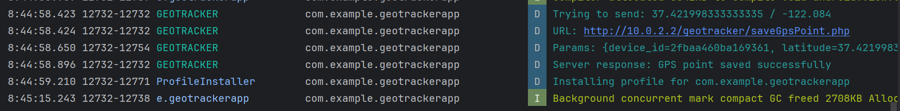

# Localisation d’un smartphone et envoi des coordonnées vers un serveur distant# GeoTracker — Application Mobile de Géolocalisation

Une application Android connectée qui capte les coordonnées GPS et les enregistre dans une base de données MySQL distante via un backend PHP.

---

## Démonstration vidéo

> 📹 **Démo**

(https://github.com/user-attachments/assets/40512046-63fa-4900-accb-376b62007f0f)

---

## Captures d'écran

| Application Android | Base de données (phpMyAdmin) |
|---|---|
|  |  |

---

## Architecture

```
Application Android  ──── HTTP POST ────▶  PHP (XAMPP)       ────▶  MySQL
(GPS + Volley)                             saveGpsPoint.php          base geotracker
```

---

## Technologies utilisées

| Couche | Technologie |
|---|---|
| Mobile | Android Java, Volley |
| Serveur | PHP 8, PDO |
| Base de données | MySQL via XAMPP |
| Outils | Android Studio, phpMyAdmin, Postman |

---

## Structure du projet

```
geotracker/                   ← dans le dossier htdocs/
├── model/
│   └── GpsPoint.php
├── db/
│   └── DbLink.php
├── repository/
│   └── IRepository.php
├── service/
│   └── GpsPointService.php
└── saveGpsPoint.php
```

---

## Base de données

**Base :** `geotracker`  
**Table :** `gps_record`

| Colonne | Type | Description |
|---|---|---|
| `rec_id` | INT AUTO_INCREMENT | Clé primaire |
| `latitude` | DOUBLE | Coordonnée Nord–Sud |
| `longitude` | DOUBLE | Coordonnée Est–Ouest |
| `captured_at` | DATETIME | Date et heure de la position |
| `device_id` | VARCHAR(60) | Identifiant unique du téléphone |

---

## Fonctionnement

1. L'application demande une mise à jour GPS toutes les **45 secondes** ou tous les **100 mètres**
2. À chaque nouvelle position, les coordonnées s'affichent à l'écran
3. Une requête HTTP POST (via Volley) envoie `latitude`, `longitude`, `captured_at` et `device_id` au serveur
4. Le script PHP reçoit les données, crée un objet `GpsPoint` et l'insère dans MySQL

---

## Remarques

- `device_id` utilise `Settings.Secure.ANDROID_ID` (compatible Android 10+)
